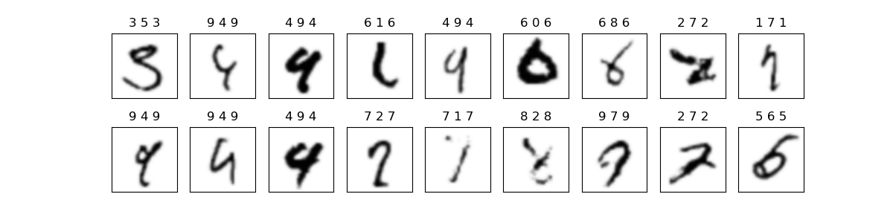

> “Now if you want to do this little dance here for old times sake, Jack, bring it.
You're gonna end up like a one-legged man in an ass-kicking contest.”<br>
&ndash; Get Carter, 2000

## Matuzas' Deep Network

[Jonas Matuzas](https://github.com/Matuzas77) came up with an exceptional convolutional neural network (convnet, cnn) in the MNIST digit recognition. The result deserves to be better known: World record error rate, small network, very fast reproducible training that fits into 2GB of VRAM. In this fork I will add some details missing in the original repo.

Firstly, lets see the resulting errors (I average only three networks to save computing time, so the error is 0.18, not 0.17 - 0.16, first label is a true class, second - best prediction, third - secondary prediction):

<table>
<tr>
<th style="text-align:center"> Test Errors</th>
</tr>
<tr>
<td>

</td>
</tr>
</table>


Is the MNIST digit classification a solved problem? Subjectively:

- Still recognizable: (3,5,3), (6,0,6), (7,1,7), (8,2,8), (9,7,9), (5,6,5), that would push 0.18% to 0.12%.
- Harder perhaps: (6,1,6), (6,8,6), (2,7,2), (1,7,1), pushing it to 0.08%.
- 4s vs 9s are hopeless.

Notice how these excellent discriminatory networks do not follow the nature of handwriting. A human can still see that it is the digit five, not six in the (5,6,5) example by noticing a mild lack of roundness in the upper left parts of the character. The extra wiggle on the lower left part indicates that the circular part of the character was written in a clock-wise direction which would be cumbersome/uneconomic to write in the case of a digit "6". 

This type of generative deconstruction is possible with the UNIPEN handwriting data sets, but it is not captured by affine deformations applied on image bitmaps. An exceptional state of the art network still fails where it should not. It does not have a clue that a wiggle occurs due to the pen being lifted in the final moment of the writing of the digit. It would be atypical to create such a wiggle at the start of the writing. 

The performance is outstanding, but this is not "AI". It lacks the very idea of the difference between "5" and "6". It does not get into the mindset of a detective :).

Some key features of Matuzas' network:

- Invoking nvidia-smi shows that without the code running my GTX 760 uses 384MiB/1998MiB of its VRAM, and with this code - 1866MiB/1998MiB, so it fits into 2GB VRAM. The batch size is only 32 though. 

- A single network is trained in only about 1h20m on a desktop PC of 2015 (i7, 16GB of RAM, Ubuntu 20.04, GTX760). The number of epochs is extremely small, i.e. 20. A single prediction of the whole test set takes 13s.

- The number of adaptive layers (input-weights-activation, not counting pooling, batchnorm and such) is **15**. There are skip connections, only 3x3 convolutions applied. Interestingly, no max-pooling, average-pooling instead!

## Current World Record (2023)

[Rodrigo Benenson's list](https://rodrigob.github.io/are_we_there_yet/build/classification_datasets_results.html) is not up to date anymore and is also somewhat unfair w.r.t. classics, more on that below. A more up to date [state of the art](https://paperswithcode.com/sota/image-classification-on-mnist) indicates the error of **0.13%**, which is on par with **0.17%**. 

The first entry in that impressive list, that of **0.09%**, is not a realizable network. It is the best observed result in a random combination of networks. There is no statistical criterion to single out such a combined network automatically from the training data alone. The report by the Korean team is a diligent work showing the error distributions obtained from about 90 networks with a practical result being 0.20% or 0.19%, depending on the network combination method (clf. Table 3 there).

We are at the state of **0.17%** - **0.13%**. Someone could still reach **0.09%** - **0.08%** in, say, ten years, but this is also highly unlikely for two reasons. It is an absolute thermodynamic limit MNIST digit wise, and also the motivation to work on such a saturated and specific/useless goal is very low. It would still be interesting to see those 8-9 ultimate misclassified images, but the goal is hardly worth the pain. To formally close the MNIST digit saga, to let go of the past?

## Revisiting the Classics  

To my knowledge, the best classical (non-deep learning) system for the MNIST digit recognition is to employ Gaussian kriging (interpolation) with max-pooled log-Gabor filters of [Peter Kovesi][Peter Kovesi]. These are my own experiments performed in the years 2014 - 2015, so I will provide here some more details. It is true that classics is no longer interesting in the context of big data, consider it as the motivation for all the multilayer complexity that followed the Alexnet circa 2012.

Feature details: Kovesi's filters must be with the default parameters tuned for image reconstruction, not discrimination. Attempts to find better parameters lead to a dead end. Prior to the 8x8 max-pooled log-Gabor image patch stage an input image needs to be split into x and y Sobel-filtered channels. 

Kriging details: Gaussian kernel interpolator whose sigma is set to the mean distance between the input patterns. **No hyperparameters**. As the kernel matrix is too big to fit into 16 GB RAM, the [tiled Cholesky decomposition][tiled Cholesky] needs to be implemented, but this presents no problems on the machine with 64GB of RAM which I used to access in the research lab in Lugano already in 2014.

The error rate is **0.29%** with some capacity to go down to **0.24%**. See also [this work][bknyaz], which corroborates the power of the Gabor wavelets with the achieved 0.30% error rate.

Multiple classifiers with input deformations may push the classical error down to **0.24%**, but it is very hard to actually realize this. In particular, the following combination is notable: 

**5x36+1x28bbwh16+1x28shear40mp56**. 

This is a weighted sum (5:1:1) of the three classifiers, each classifier is trained on a separate deformed set of the MNIST training digits. Each training set consists of 60K deformed patterns obtained by applying the same deformation to every single original image. The first classifier resizes the images to 36x36, the second one resizes the digit's bounding box to 16x16, followed by the centering of the bounding box within a 28x28 matrix. The third classifier sees the images which are first x-sheared with a -0.40 factor, which results in 28x39 bitmaps. Each such bitmap is then truncated by five columns from the left and six columns from the right, resulting in a 28x28 matrix.

There are simpler ways to achieve the error of **0.26%** (no shearing involved): 32+32+28bbwh26, 32+36+28bbwh26, 36+36+28bbwh16. None of this is automatically realizable from the training set and statistical model selection alone.

## [Adam Coates et al. 2010][Adam Coates et al. 2010]

Unlike the log-Gabors that work only for black & white "stroke-based" images, the triangular encoding of patch distances presents quite universal discriminatory image features. The best of a kind circa 2010. Kriging with such features reaches a solid "off the shelf" MNIST digit error of **0.35%**. I have tried 50K, or even 100K filters, i.e. 400K dimensional feature vectors (!), different parameter settings as well. Paradoxically, nothing led to anything better than 0.35%. 

By the way, the triangular encoding can also be replaced with a more typical Gaussian kernel-based 
conversion of distances to similarities (set sigma to the mean patch distance used in the triangular encoding). The former is more efficient and works when the feature dimension is large.

For those curious about where the classics really ends on the CIFAR-10 data set, the Gaussian kernel interpolator (kriging) produces the following performance values: 80.30% (4608 features), 84.64% (100K features), and 85.70% (400K features). Local patch contrast normalization is necessary, i.e. 81.52% performance without local contrast normalization (100K features). The performance value of 85.70% is probably not the limit of this method, but it is too cumbersome to reach even this. [Adam Coates et al. 2010][Adam Coates et al. 2010] report 79.6% reached with 4K features.

The case with 400K features (100K patch centroids) takes roughly 10K+10Ks. (twenty kilo-seconds!) of time for feature extraction, 54Ks. for tiled Cholesky decomposition and linear solving, and about 12Ks. for testing. So this is very time-consuming on i7 with 16GB of RAM and GTX760, but there is a lot of opportunity for parallelizations, albeit pointless in light of convnets (cnns). By the way, the float32 products might further speed up the codes when calculating the kernel entries, but single precision is definitely not enough for the products inside the tiled Cholesky decomposition as the code barfs about nonpositive definite submatrices, this problem does not appear in the double precision. 

## Classical Model Weaknesses

Convnets = SGD + autograd + GPU. Classics = everything else.

- Linear algebra is cubic and demands float64 or at very least float32. Ill-conditioned Hessians, kernel/covariance matrices... 

- Leo Breiman's trees were very elegant, but not accurate enough even when compared to kriging/SVMs, even after they became forests.

- Averaging or maxing-out classical models with tiny deformations does not improve the error rates. I wasted so much time to get this simple truth, even killed my SSD before its warranty time (by running the block Cholesky on 100K+ matrix sizes with 16GB RAM which demanded getting blocks back and forth from RAM to SSD). 

- The best classical MNIST error rate of 0.30%-0.29% should not be hard to replicate, but 0.24% is already a practically unreachable outlier that may involve undocumented hidden factors such as Matlab's interpolation type during the shearing of images and even image dithering may have an impact.

- The best classical CIFAR-10 error rate is 85.70% (my personal experiments of kriging the features of Adam Coates et al. 2010). Convnets did surpass [99% around the year 2020](https://paperswithcode.com/sota/image-classification-on-cifar-10).

## Further Notes

- The most interesting ML projects are community efforts now: PyTorch, Leela Chess Zero, [Stable Diffusion](https://lambdalabs.com/blog/inference-benchmark-stable-diffusion)...

- Training becomes very costly. "According to Mostaque, the Stable Diffusion team used a cloud cluster with 256 Nvidia A100 GPUs for training. This required about 150,000 hours, which Mostaque says equates to a market price of about $600,000."

- "Chinese publication Jitwei revealed that ByteDance has already ordered around [$1 billion worth of Nvidia GPUs in 2023 so far](https://www.tomshardware.com/news/chinas-bytedance-has-gobbled-up-dollar1-billion-of-nvidia-gpus-for-ai-this-year)..."

- [In the year 2525, if man is still alive...](https://www.youtube.com/watch?v=zKQfxi8V5FA)

## References

- [anaconda]
- [anaconda-critique]
- [compute-capability-3.0]
- [Peter Kovesi]
- [backprop]
- [Adam Coates et al. 2010]
- [bknyaz]
- [state of the art]

[anaconda]: https://docs.anaconda.com/anaconda/install/linux/
[anaconda-critique]: https://www.youtube.com/watch?v=8byjq_S28PQ
[compute-capability-3.0]: https://stackoverflow.com/questions/39023581/tensorflow-cuda-compute-capability-3-0-the-minimum-required-cuda-capability-is
[Peter Kovesi]: https://www.peterkovesi.com/matlabfns/
[backprop]: https://direct.mit.edu/neco/article-pdf/8/1/182/813161/neco.1996.8.1.182.pdf
[tiled Cholesky]: http://eprints.ma.man.ac.uk/856/01/covered/MIMS_ep2007_122.pdf
[Adam Coates et al. 2010]: http://ai.stanford.edu/~acoates/papers/CoatesLeeNg_nips2010_dlwkshp_singlelayer.pdf
[bknyaz]: https://github.com/bknyaz/gabors
[state of the art]: https://paperswithcode.com/sota/image-classification-on-mnist

## Appendix: Setting Up Keras

I split the original Jupyter notebook file into two files: training (main.py) and prediction (save_predictions.py), and added the plotting file "plot_errors.py" which produces the figure above.

Workflow:

- Install [conda][anaconda]. It makes life so much easier, but also see this [emotional critique][anaconda-critique].

- My GPU card is GTX760, its computing capacity is 3.0 and that demands installing specific library versions provided in this [SO question][compute-capability-3.0]:
```console
conda create -n tf-gpu
conda activate tf-gpu
conda install tensorflow-gpu=1.12
conda install cudatoolkit=9.0
conda install -c anaconda scikit-learn
conda install -c conda-forge pudb
conda install -c conda-forge matplotlib
```

- To remove the environment some day:
```console
conda info --envs
conda deactivate
conda remove --name tf-gpu --all
```

- To test the code, run these commands:
```console
conda activate tf-gpu
python main.py
python save_predictions.py
python plot_errors.py
```

